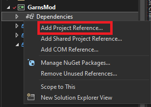
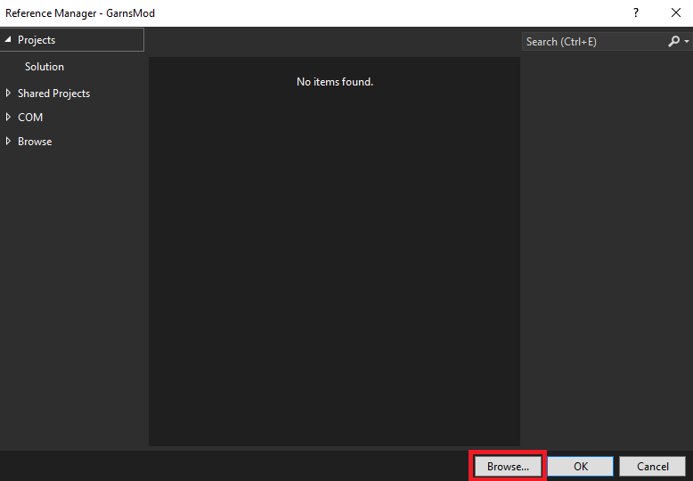
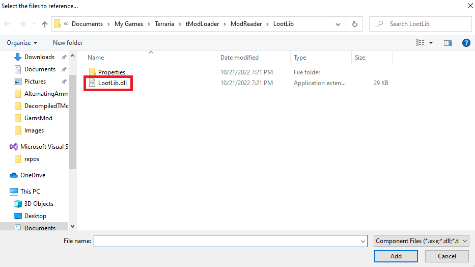
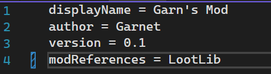

# LootLib

LootLib is a library that makes it much easier to modify `NPCLoot` or `ItemLoot` in tModLoader. If you are developing a mod that will make many changes to vanilla loot, this
library will make your code much simpler, more flexible, compatible, and readable. It adds one static class called `LootExtensions` 
to your development environment. This class adds dozens of extension methods to `ILoot` and `IItemDropRule`, as well as extensions to many sub clases of `IItemDropRule`. Check out
the [wiki](https://github.com/Garnet-Yeates/LootLib/wiki) to see its use cases. 

# How to reference LootLib in your project (Visual Studio 2022)

## Extracting the DLL
After downloading this mod from the steam workshop (or the in game mod browser), press 'workshop' in the tModLoader main menu and do the following steps:

Click `Manage Mods`, then `?` on LootLib, then click `Extract`


## Referencing the DLL in Visual Studio 2022

Right click `Dependencies` under your `.csproj`, choose `Add Project Reference`



Click `Browse`



Find Where `LootLib.dll` is extracted to and double-click it.



## Registering LootLib as a Dependency for Your Mod

Add the following line to your `build.txt`



Doing this will make it so `LootLib` is downloaded automatically when someone downloads your mod (it will say "download with dependencies" when they hover over the download button)

## Next Steps

Now that you have successfully referenced the `.dll` and also added LootLib as a dependency in the `build.txt`, you should be able to use any of the extension methods provided by LootLib. Simply add

```cs
using LootLib;
```

to the top of whatever `.cs` file you want to use `LootExtensions` inside of and it should work. 

Check out the [wiki](https://github.com/Garnet-Yeates/LootLib/wiki) to see how to use the API. 
